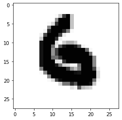
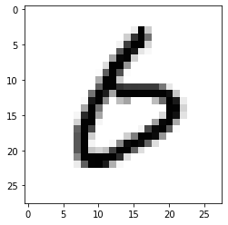
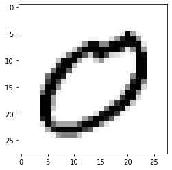
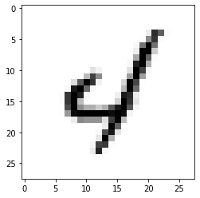
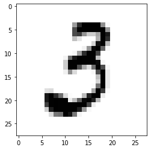
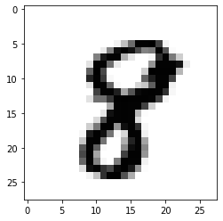
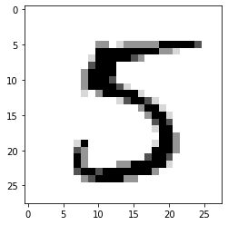
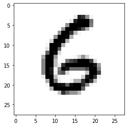
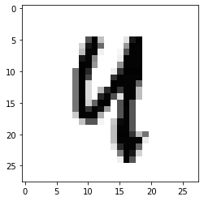

# MNIST data를 이용한 DL

### MNIST data란?
MNIST 데이터는 손으로 쓰여진 숫자 0-9로, 훈련을 위한 이미지와 테스트를 위한 이미지로 이뤄져 있다. MNIST 데이터베이스는 전처리 과정이 최소화된 알고리즘에 널리 사용된다. 머신 러닝 알고리즘을 학습하기 좋은 간편한 데이터베이스며, 이미지 분류 문제를 위한 가장 유명한 데이터베이스이다.  

이미지는 28 * 28 픽셀 크기로 정규화 됐고 그레이 스케일로 변환됐으면 중앙 정렬돼 있다.

### epoch & batch & iteration
- 1 epoch란 훈련 데이터셋에 포함되어 있는 모든 데이터값들이 각각 한번씩 예측 모델에 들어온 뒤 weight 값을 갱신하는 주기를 의미한다. 기계학습 모델을 훈련시키기 위하여 여러번의 epoch를 사용하는 이유는 이후 새로운 데이터에 대한 일반화 능력을 향상시키고 각 epoch에서 Local Minima에 갇히는 상황을 보완하는데 도움을 주기 때문이다.
- batch size는 하나의 mini-batch를 몇개의 데이터로 구성할지에 대한 정보이다. 예를들어 100개의 이미지-라벨이 있는 상황에서 batch size를 5로 정한다면 한번에 하나의 데이터를 볼때 마다 weigt를 갱신하는게 아니라 5개의 데이터에 대한 값을 한번에 계산한뒤 weight를 갱신한다.
- Iteration은 한 epoch를 진행하기 위해 몇 번의 가중치 갱신이 이루어지는지에 대한 정보이다. ex: 1000개의 훈련 데이터를 가지고 있고 batch size가 200이라면 5 iteration을 가진다고 할 수 있다.


```python
import tensorflow as tf
from tensorflow.examples.tutorials.mnist import input_data
import matplotlib.pyplot as plt
import random

mnist= input_data.read_data_sets("MNIST_data/", one_hot=True)

nb_classes = 10
#MNIST data image of shape 28*28 = 784
X= tf.placeholder(tf.float32,[None,784])
# 0 - 9 digits recognition = 10 classes
Y=tf.placeholder(tf.float32,[None,nb_classes])

W= tf.Variable(tf.random_normal([784,nb_classes]))
b= tf.Variable(tf.random_normal([nb_classes]))

#Hypothesis (using softmax)
hypothesis = tf.nn.softmax(tf.matmul(X,W)+b)

cost = tf.reduce_mean(-tf.reduce_sum(Y*tf.log(hypothesis),axis=1))
optimizer = tf.train.GradientDescentOptimizer(learning_rate=0.1).minimize(cost)

#Test moder
is_correct= tf.equal(tf.arg_max(hypothesis,1),tf.arg_max(Y,1))
# Calculate accuracy
accuracy = tf.reduce_mean(tf.cast(is_correct,tf.float32))

#parameters
training_epochs = 15
batch_size = 100

with tf.Session() as sess:
    # Initialize TensorFlow variables
    sess.run(tf.global_variables_initializer())
    # Training cycle
    for epoch in range(training_epochs):
        avg_cost=0
        total_batch = int(mnist.train.num_examples / batch_size)
        
        for i in range(total_batch):
            batch_xs, batch_ys = mnist.train.next_batch(batch_size)
            c, _ = sess.run([cost,optimizer], feed_dict={X: batch_xs, Y: batch_ys})
            avg_cost += c / total_batch
        
        print('Epoch:', '%04d' %(epoch+1), 'cost=', '{:.9f}', format(avg_cost))
        # Test the model using test sets
        print("Accuracy: ", accuracy.eval(session=sess, feed_dict={X: mninst.test.images, Y: mnist.test.labels}))
        #Sample image sho and prediction
        #Get one and predict
        r=random.randint(0,mnist.test.num_examples-1)
        print("Lable:",sess.run(tf.argmax(mnist.test.labels[r:r+1],1)))
        print("Prediction:", sess.run(tf.argmax(hypothesis,1),feed_dict={X: mnist.test.images[r:r+1]}))
        plt.imshow(mnist.test.images[r:r+1].reshape(28,28),cmap='Greys', interpolation='nearest')
        plt.show()
```

    Extracting MNIST_data/train-images-idx3-ubyte.gz
    Extracting MNIST_data/train-labels-idx1-ubyte.gz
    Extracting MNIST_data/t10k-images-idx3-ubyte.gz
    Extracting MNIST_data/t10k-labels-idx1-ubyte.gz
    Epoch: 0001 cost= {:.9f} 2.8637512127919638
    Accuracy:  0.7564
    Lable: [9]
    Prediction: [9]
    


    

    


    Epoch: 0002 cost= {:.9f} 1.1155382276665093
    Accuracy:  0.8176
    Lable: [6]
    Prediction: [6]
    


    

    


    Epoch: 0003 cost= {:.9f} 0.8900230550765987
    Accuracy:  0.8413
    Lable: [6]
    Prediction: [0]
    


    

    


    Epoch: 0004 cost= {:.9f} 0.7773915405165059
    Accuracy:  0.8533
    Lable: [6]
    Prediction: [4]
    


    

    


    Epoch: 0005 cost= {:.9f} 0.7066380283236506
    Accuracy:  0.8619
    Lable: [0]
    Prediction: [0]
    


    

    


    Epoch: 0006 cost= {:.9f} 0.6560625011812555
    Accuracy:  0.8699
    Lable: [4]
    Prediction: [4]
    


    

    


    Epoch: 0007 cost= {:.9f} 0.6175112309780988
    Accuracy:  0.8747
    Lable: [3]
    Prediction: [3]
    


    

    


    Epoch: 0008 cost= {:.9f} 0.5862780097126958
    Accuracy:  0.879
    Lable: [8]
    Prediction: [8]
    


    

    


    Epoch: 0009 cost= {:.9f} 0.5607287912748077
    Accuracy:  0.8819
    Lable: [7]
    Prediction: [7]
    


    

    


    Epoch: 0010 cost= {:.9f} 0.5397976854714477
    Accuracy:  0.884
    Lable: [8]
    Prediction: [3]
    


    

    


    Epoch: 0011 cost= {:.9f} 0.5216935371539808
    Accuracy:  0.888
    Lable: [1]
    Prediction: [1]
    


    

    


    Epoch: 0012 cost= {:.9f} 0.5054883847317907
    Accuracy:  0.8901
    Lable: [5]
    Prediction: [5]
    


    

    


    Epoch: 0013 cost= {:.9f} 0.4916729528389192
    Accuracy:  0.8918
    Lable: [6]
    Prediction: [6]
    


    

    


    Epoch: 0014 cost= {:.9f} 0.47877988398075166
    Accuracy:  0.8908
    Lable: [6]
    Prediction: [6]
    


    

    


    Epoch: 0015 cost= {:.9f} 0.46794520342891877
    Accuracy:  0.8934
    Lable: [4]
    Prediction: [8]
    


    

    

